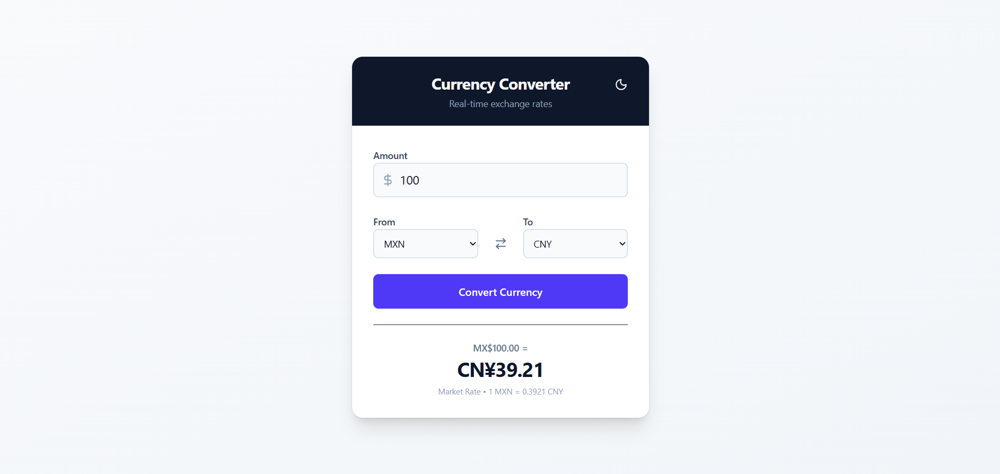
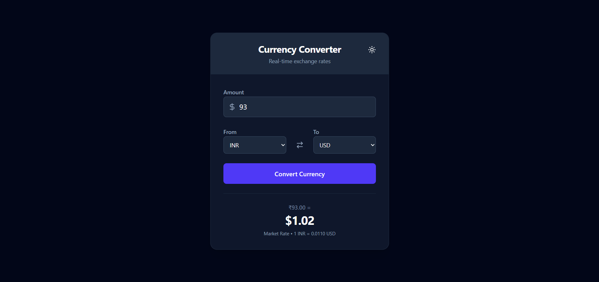

# 💱 React Currency Converter

A modern, responsive, and real-time currency converter application built with **React**, **Tailwind CSS**, and the **Frankfurter API**.


## ✨ Features

* **Real-time Exchange Rates:** Fetches the latest data from the Frankfurter API.
* **Dark Mode Support:** Seamless toggle between Light and Dark themes.
* **Currency Swap:** Instantly swap "From" and "To" currencies with a single click.
* **Responsive Design:** Fully responsive UI built with Tailwind CSS.
* **Loading States:** Visual feedback with spinners during API requests.
* **Error Handling:** User-friendly error messages for network issues or invalid inputs.

## 🛠️ Tech Stack

* **Frontend Library:** [React.js](https://reactjs.org/)
* **Styling:** [Tailwind CSS](https://tailwindcss.com/)
* **Icons:** [Lucide React](https://lucide.dev/)
* **API:** [Frankfurter API](https://www.frankfurter.app/) (Open Source)

## 🚀 Getting Started

Follow these steps to get a local copy up and running.

### Prerequisites

* Node.js (v14 or higher)
* npm or yarn

### Installation

1.  **Clone the repository**
    ```bash
    git clone [https://github.com/AdityaBhosale22/currency-converter.git](https://github.com/AdityaBhosale22/currency-converter.git)
    cd currency-converter
    ```

2.  **Install dependencies**
    ```bash
    npm install
    # or
    yarn install
    ```

3.  **Start the development server**
    ```bash
    npm run dev
    # or
    yarn dev
    ```

4.  Open your browser and navigate to `http://localhost:5173` (or the port shown in your terminal).

## 📂 Project Structure


```

src/
├── components/
│   └── CurrencyConverter.jsx  # Main logic and UI
├── App.jsx                    # Root component
├── main.jsx                   # Entry point
└── index.css                  # Tailwind directives

```

## 📸 Screenshots

### Light Mode


### Dark Mode


## 🤝 Contributing

Contributions are what make the open-source community such an amazing place to learn, inspire, and create. Any contributions you make are **greatly appreciated**.

1.  Fork the Project
2.  Create your Feature Branch (`git checkout -b feature/AmazingFeature`)
3.  Commit your Changes (`git commit -m 'Add some AmazingFeature'`)
4.  Push to the Branch (`git push origin feature/AmazingFeature`)
5.  Open a Pull Request

## 📝 License

Distributed under the MIT License. See `LICENSE` for more information.

---

<p align="center">
  Built with ❤️ using React & Tailwind
</p>

```